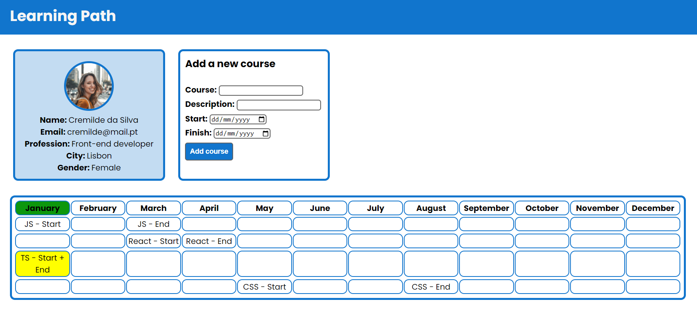

# TypeScript Exercise 2 - Learning Path

Simple exercise to practice the conversion of JavaScript code into TypeScript.

You can add a new course by filling and submitting the form "Add new course". The courses submitted will be saved in local storage.

The color green highlights the current month. The yellow color signs that the course is about to finish in the current month.

